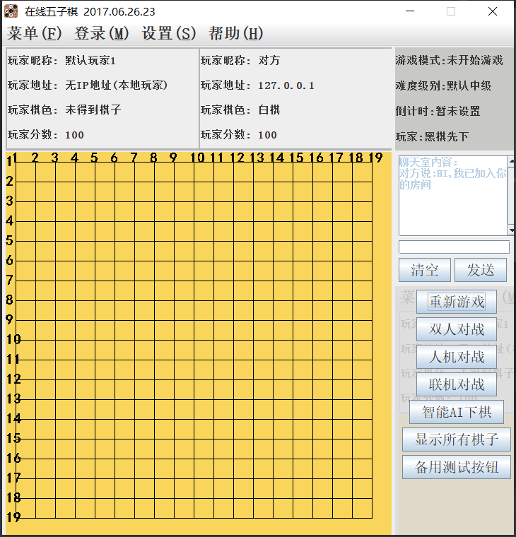
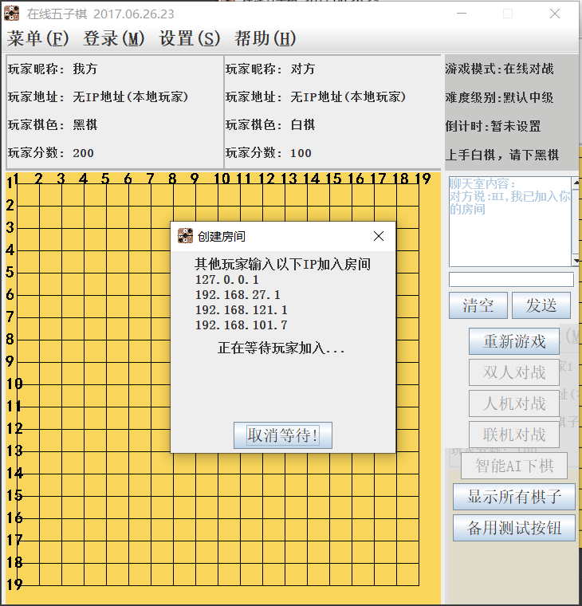
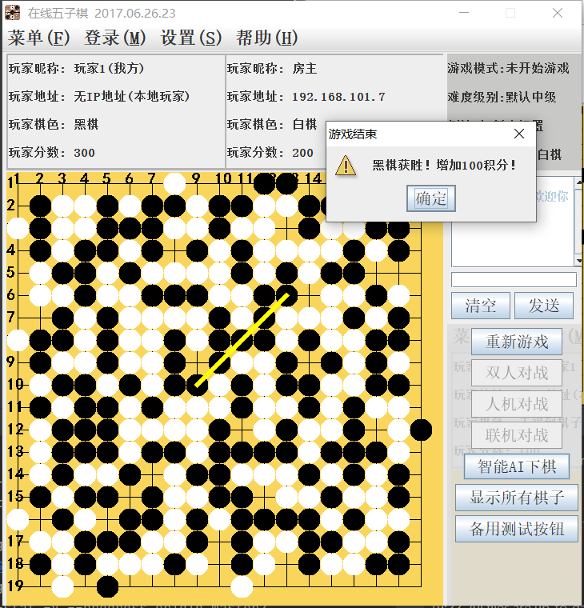

##### Online Backgammon Game - Chengdu Technological University

### 在线五子棋游戏 - 成都工业学院

### 软件说明

- 项目名称：在线五子棋/在线五子棋游戏
- 主要功能：联机联机对战，聊天室，人机对战，AI自动下棋
- 当前版本为离线版(支持联机对战)，不需要服务器支持，可在内外和外网环境中使用对战功能。
- 如需在线版(服务器保存用户信息，并支持web端)，请查看Gobang04 https://github.com/bzsome/Gobang04

### 运行效果图
程序主界面  -  创建联机房间  -  游戏对战及胜负判断

    
### 功能及玩法

- 玩法（共三种）
  - 双人对战：一台电脑上，两个人下棋
  - 人机对战：一台电脑上，白棋为玩家，黑棋为电脑AI(自动下棋)
  - 联机对战：两台电脑上，白棋创建房间，黑棋输入白棋玩家的IP加入房间

- 智能AI下棋
  - 使用`智能AI下棋`按钮，将根据AI算法，自动帮你下棋。

- 联机对战
  - 两台电脑的IP必须可通
  - 在同一局域网中，输入对方局域网的IP
  - 房主在公网IP中，加入房间时输入房主的公网IP

- 聊天室
  - 加入同一房间的玩家，可在聊天室相互对话

### 启动方式

- 软件环境：纯jdk8代码，未引入任何依赖包和插件

- 相关技术：Java8，Swing，Socket，多线程，异步处理

- 启动方式：导入Maven项目，执行MainActivity.java

### 项目开发说明：

- 开发起因说明

  本项目为在大二在校期间(2017年)的一个课程设计。4-6人一组，有多个选题，且可自主选题。我们这组本次选题为五子棋，开发周期大概为2周。

- 项目开发说明

  完全自主开发，根据课堂所学知识，以及面向百度编程思想，摸索中完了项目。请尊重版权。

- 项目更新说明

  由于项目完善度较高，功能均比较正常。但文档不全，本次更新主要对文档更新，并优化代码规范(未更新逻辑)

- 其他开发者

  软件编码：陈光超， 智能算法：袁志强， 软件测试：芶 钰

- 其他说明

  由于大二时开发水平有限，本次(2021年)更新未更改代码结构，不足地方较多，后面有时间再进行重构。

### 更新日志

- [2021年更新日志](docs/change_log_2021.md)

- [2017年更新日志](docs/change_log_2017.md)

### 待完善功能

- 联机对战时，重新游戏不需要再次加入房间
- 联机对战时，也能使用AI智能下棋
- 打包成exe，不需要安装jvm也能运行

#### 成都工业学院，计算机工程学院 - 软件工程
